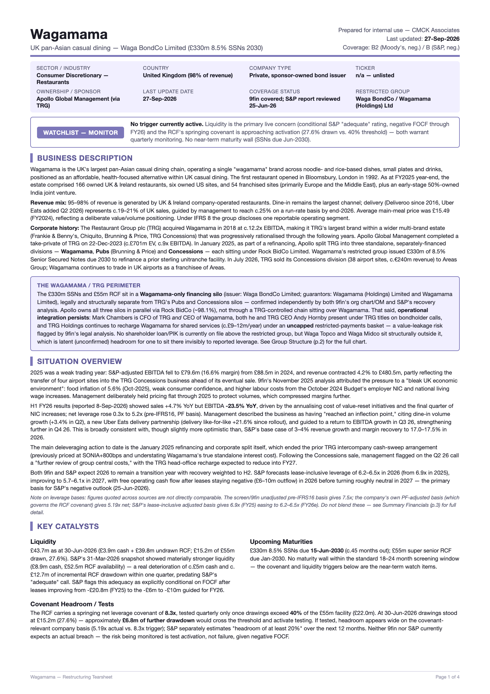
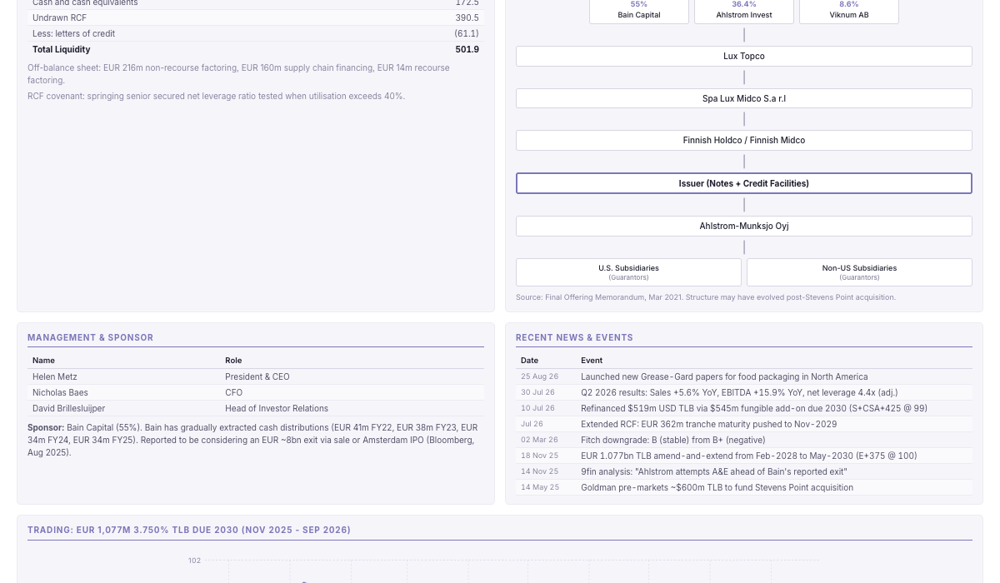
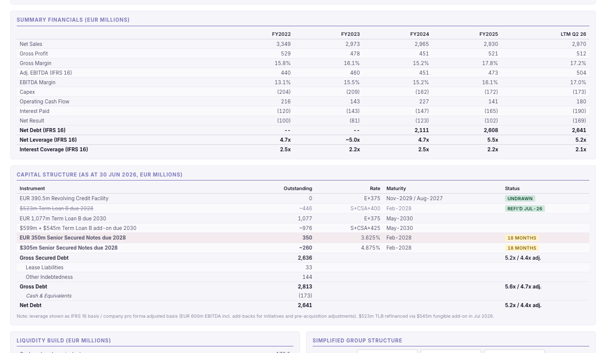
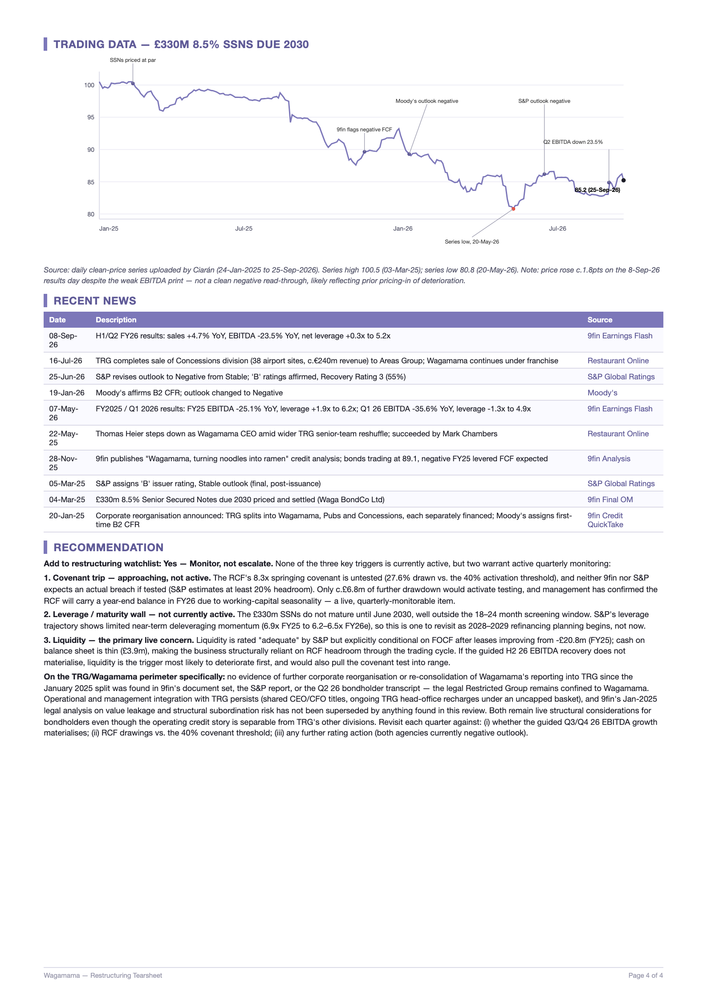

# Restructuring Target Screener

An AI-powered weekly screening workflow that identifies potential European restructuring targets using [9fin](https://9fin.com) data, produces one-page company tearsheets, and emails the results to the team.

Built with [Claude Code](https://claude.com/claude-code) and the 9fin MCP server.

For a fuller walkthrough of the workflow and the thinking behind it, see the supporting presentation: [9fin MCP Agent Supporting Materials.pdf](docs/Presentation/9fin%20MCP%20Agent%20Supporting%20Materials.pdf)

## Project Purpose

Restructuring investment banking teams need to stay on top of newly stressed European corporate credits. This workflow automates the repetitive parts of that process: screening for price drops, pulling financial data, assessing whether a company is a genuine restructuring candidate, and producing a formatted summary that a senior banker can read in five minutes before a client call.

The system screens for three key restructuring triggers:

1. **Covenant trip** - a company approaching or breaching financial covenants
2. **Maturity wall** - large debt maturities that cannot be refinanced at current leverage
3. **Liquidity shortfall** - insufficient cash and facilities to fund operations through the near term

## Use Cases

- **Weekly screening** - automated Sunday evening run that sources names directly from 9fin's most recently published European Weekly Stressed and Distressed Data Report (watchlist entrants and top weekly price losers), triages the results, and waits for analyst input on which names to progress
- **Ad hoc screening** - manually triggered run against the 9fin bond/loan screener with custom criteria (different regions, rating bands, price thresholds, or sectors)
- **Ad hoc deep dives** - off-cycle Phase 2 workup on a specific name (e.g. following market color or a creditor comment), even where the prior weekly call was "pass"
- **Company tearsheets** - one-page, print-ready summaries for selected targets covering business description, financials, capital structure, trading, holders, and a clear recommendation
- **Email delivery** - covering email with a link to a shared Claude artifact sent to the team, summarising the week's findings

## Workflow Steps

### Phase 1: Weekly Screen

The source of names depends on how the run is triggered:

- **Scheduled Sunday-night run** - sources names directly from the most recently published 9fin European Weekly Stressed and Distressed Data Report: this week's entrants to 9fin's distressed and restructuring watchlist, plus the top weekly price losers across the European market, taken as published with no additional filtering. The bond/loan screener has no way to filter on week-over-week price movement, which is the actual signal this run exists to catch, so the weekly report is the better-fitted source for this cadence.
- **Manually triggered run** - queries the 9fin bond/loan screener instead, either with the confirmed default criteria (priced, corporate, Europe, BB/B/CCC rated) or with custom criteria the analyst supplies for that run (region, rating band, price threshold, sector, minimum size, etc.)

Both paths then continue the same way:

1. Pull business description, key financials, leverage, trading levels, and credit rating for each name identified
2. Check each name against the running target list for continuity across weeks (reappearing names are only fully reworked if something material has changed since the prior assessment)
3. Build a triage table with a recommendation for each name ("further work" or "pass") tied to the three triggers
4. Present the triage table and wait for the analyst to select which names to take forward

### Phase 2: Company Tearsheet

For each selected name, build a structured, print-ready tearsheet covering:

- Header block with key stats (revenue, EBITDA, leverage, liquidity)
- Business description and situation overview
- Key catalysts and triggers to watch
- Management and sponsor representation
- Capital structure table with pricing and maturities
- Liquidity build and group structure chart
- Debt holdings (top holders by instrument)
- Revenue splits and summary financials (multi-year, including FCF build)
- Trading chart with annotated credit events
- Recent news and final recommendation with rationale

A single-instrument, thinly-covered name may fit on one page; a fully worked-up situation like the Wagamama example below typically runs to three or four A4 pages once every section has real data behind it.

### Phase 3: Delivery

1. Render tearsheets as A4 portrait PDFs using Puppeteer, kept as the local archival record
2. Publish the tearsheet HTML (combined across companies if more than one) as a Claude artifact and turn on link sharing
3. Draft a covering email with the artifact link, using the team template
4. Confirm content, recipients, and that the link is shared, with the analyst, then send via Gmail

## Agent Architecture

The workflow uses five specialised Claude Code sub-agents:

| Agent | Role |
|---|---|
| `screener` | Phase 1: queries 9fin, pulls initial data, builds triage table |
| `researcher-financials` | Phase 2: business description, revenue splits, summary financials, FCF build |
| `researcher-capital` | Phase 2: capital structure, liquidity, org chart, trading, holders |
| `researcher-news` | Phase 2: news, 9fin analysis, management, situation overview, recommendation |
| `auditor` | Phase 2.5: cross-references the three researchers' outputs against each other and against any uploaded resources for the same company, flagging discrepancies before the tearsheet is built |

The three Phase 2 researchers run in parallel for each company. Once all three finish, the auditor checks their outputs for internal consistency (e.g. the same debt instrument's size or maturity reported differently) before the orchestrating session builds the final tearsheet.

## Example Outputs

The screenshots below are the actual four-page tearsheet produced for **Wagamama** (UK casual dining, Apollo-sponsored, £330m 8.5% Senior Secured Notes due 2030) — a fully worked-up, watchlist-monitor recommendation that shows the format at full depth.

### Page 1: Header, Business Description, Situation Overview, Key Catalysts

Company header with ratings and coverage status, key stats box, watchlist call, business description with corporate history, situation overview with sourced commentary, and key catalysts (liquidity, maturities, covenant headroom) stated against explicit levels and dates.



### Page 2: Management, Capital Structure, Liquidity, Group Structure

Management and sponsor table with relevant experience, instrument-level capital structure with pricing and covenant detail, a liquidity sources-and-uses build, and a simplified group structure chart showing exactly where the debt sits relative to the restricted group.



### Page 3: Debt Holdings, Revenue Splits, Summary Financials, FCF Build

Top-10 holder register with cumulative percentages, revenue splits by geography, multi-year summary financials, and the full FCF build through to UFCF/LFCF conversion — a negative conversion is flagged in red italics rather than shown as a misleadingly precise negative percentage.



### Page 4: Trading Chart, Recent News, Recommendation

Annotated instrument-price trading chart with credit events called out against the date they occurred, a dated recent-news table with sourced links, and the final recommendation tied explicitly back to the three key triggers.



## Folder Structure

```
/workflows          Workflow SOP and agent definitions
/outputs            Generated tearsheets (HTML) and combined PDFs
/target_list        Running record of screened companies across weeks
/Templates          Email template and recipient mappings
/resources          Company-specific reference materials (holder data, pricing CSVs)
/drafts             Work in progress
/Precedent Emails   Archive of sent emails
/docs/Presentation  Supporting presentation on the workflow (PDF)
/.claude/agents     Sub-agent definitions (screener, researchers)
```

## Data Sources

All company data is sourced via 9fin's MCP server:

- Document search (primary source for the scheduled weekly run - the European Weekly Stressed and Distressed Data Report)
- Company and bond/loan screener filters (manual runs only)
- Business descriptions and financial statements
- Capital structure and covenant data
- Org charts and ownership structure
- News, analysis documents, and earnings transcripts
- Instrument pricing and holder data

## Limitations

- **9fin coverage only** - the screener and tearsheet content depend entirely on 9fin's data. Companies outside 9fin's coverage universe will return limited or no data and are flagged as requiring direct sourcing.
- **No real-time pricing** - instrument prices and trading data reflect 9fin's last available snapshot, not live market data. Tearsheets note the as-of date.
- **European corporates focus** - the default criteria target European leveraged credits. Other regions or asset classes (sovereigns, financials, EM) require manual criteria and may have sparser data.
- **Financial data gaps** - where 9fin does not have granular line items (e.g. detailed FCF builds, segment-level margins), the tearsheet flags these as "not available - further diligence required" rather than inferring figures.
- **Holder data availability** - debt holder data depends on regulatory filings and 9fin's aggregation. Coverage varies by instrument and jurisdiction; some instruments may show no holders.
- **No proprietary models** - the recommendation is a qualitative assessment against the three triggers, not a quantitative model. It is intended as a starting point for further analysis, not a standalone investment recommendation.
- **Email delivery** - requires Gmail MCP integration. The email is always confirmed with the analyst before sending.
